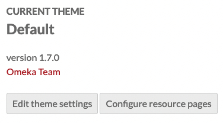

# Configurable Resource Page Blocks

Omeka S comes with exciting new features, notably configurable blocks for show pages for items, item sets, and media. This feature allows site authors to include and position different types of content on these show pages. This configurable content, organized as “blocks”,  includes the resource’s values, item sets, linked resources, as well as different ways to present associated media.

## Adding Resource Page Block Configuration to Themes

### Defining Regions in Theme Configuration

Start with your theme.ini file. There, you need to define both your configurable regions as well as the blocks they support. 

You can create regions for items, item sets, and media. You start by identifying configurable resource views as parameters for resource_page_regions, then naming each region. This is an example of creating a region called “main” for the item show view.

```text
resource_page_regions.items.main = "Main"
```

You always start with `resource_page_regions`. The next part says that the region will appear on item show pages. The last parameter is what you name your region, and the assigned value is the nice name for the region that will appear in the admin interface.

After creating your region, you need to define what blocks the region will include by default. **The ability to configure resource pages will only appear after both a region and a default block for that region have been defined.** The following is a list of all of Omeka S’s provides for configuration, as well as the resource pages that support them.

**Block**|**Short name**|**Item**|**Media**|**Item Set**
:-----:|:-----:|:-----:|:-----:|:-----:
Values|values|✅|✅|✅
Site Pages|sitePages|✅|✅|✅
Linked Resources|linkedResources|✅|✅|✅
Resource class|resourceClass|✅|✅|✅
Media Embeds|mediaEmbeds|✅|✅| 
LightGallery media viewer|lightGallery|✅|✅| 
Item Sets|itemSets|✅| | 
Media List|mediaList|✅| | 

Resource pages typically include their metadata values, making that block a good candidate for default inclusion. This example defines the values block as a default block for item pages’ main region.

```text
resource_page_blocks.items.main[] = "values"
```

You take most of the same content from the last example, `resource_blocks.items.main` and add to its array of blocks by setting a block’s short name. The table shows that the short name for values is simply `values`. You do this for every block you want to make default for the region. 

After you include this line in your `theme.ini`, you can access the resource page configuration in the Omeka S interface. Navigate to your site admin area, then “Themes”. Make sure your theme is active. Once it is, a button reading “Configure resource pages” will appear underneath the theme description.



Clicking through will lead you to an interface that shows the following view.

![Screenshot from the site theme view within the Omeka S admin area. It spotlights configurable blocks for resource pages. In the top bar, there is a laptop icon with the label "THEME". The page title reads "Default - Configure resource pages." There are "Canel" and "Save" buttons to the right. In the main content area, there are three tabs, one for each resource type's show page: "Item page", "Media page", and "Item set page". The "Item page" is the current selection. Under the tab is the heading "Region: Main". Under the heading there is a gray-bordered rectangle with a gray filled row reading "Values". The row has an icon to the left, showing three horizontal bars to indicate that the row is draggable. On the right end of the row, there is a trash can icon indicating the row can be deleted. To the right of the tabs and that region interface, there is a sidebar. It includes heading "Select a region", followed by a select dropdown with the "Main" option currently active. Under those, there is an "Add a block to selected region" heading. It is followed by a button labeled "Item sets" with a light gray plus icon on its right.](../img/resource_page_blocks-2.jpg)

If you want to allow an item show view to automatically display item sets, linked resources, and media lists, it would look like the following example.

```text
resource_page_blocks.items.main[] = "itemSets"
resource_page_blocks.items.main[] = "linkedResources"
resource_page_blocks.items.main[] = "mediaList"
```

If you want a block to be available for every resource type, you must define it for each resource view. For example, you likely want to make resource values configurable for each type. You would need three separate lines telling the theme that each resource type should automatically display value blocks.

```text
resouce_page_blocks.items.main[] = "values"
resouce_page_blocks.item_sets.main[] = "values"
resouce_page_blocks.menu.main[] = "values"
```

### Default Content On Show Pages

The following is a list of the default content that appeared in show pages for items prior to the configurable blocks feature:

**Block**|**Short name**
:-----:|:-----:
Values|values
Item Sets|itemSets
Site Pages|sitePages
Linked Resources|linkedResources
Media List|mediaList

Show pages for item sets and media only displayed the resource values by default.

## Displaying Page Blocks in the Views

### Default View Output

If your theme relies on default views from Omeka S, your theme will automatically have a single main region where configured page blocks appear. The default views include a line similar to the following to display the blocks. This example is from the show page for items, so it passes `$item`.

```php-template
<?php echo $this->resourcePageBlocks($item)->getBlocks(); ?>
```

### Custom Views with Multiple Region Support

To support multiple regions that can display blocks, you need to have custom versions of the show pages within your theme. You also need to define multiple regions in your `theme.ini`. In the following example, the theme supports a “main” content region, as well as a “right sidebar” in the show pages for items.

```text
resource_page_regions.items.main = "Main"
resource_page_regions.items.right = "Right Sidebar"
```

These two regions should appear in the resource page block configuration interface, ready for populating with blocks.

![Screenshot from the site theme view within the Omeka S admin area. It shows the main content area, which includes the three resource type page tabs at the top. There are two regions: "Region: Main" and "Region: Right sidebar". "Region: Main" has 5 sortable and deletable rows: "Values", "Item Sets", "Site pages", "Linked resources", and "Media embeds". "Region: Right sidebar" is empty. In the interface's right sidebar, there is the "Select a region" heading. The select underneath it is open, exposing "Main" and "Right sidebar" as options. The "Main" option is highlighted. The heading underneath is obscured by the open dropdown, and is followed by 4 buttons with labels and a "plus" icon to the right: "Lightbox gallery", "Media list", "Resource class", and "Mapping".](../img/resource_page_blocks-3.jpg)

To output these configured regions, the theme must define where in show.phtml these blocks will appear. The blocks for each region are called by passing the region’s short name from `theme.ini` into `resourcePageBlocks()`. The two regions might look like the following within a show.phtml:

```php-template
<div class="main-content">
    <?php echo $this->resourcePageBlocks($item, 'main')->getBlocks(); ?>
</div>

<?php if ($this->resourcePageBlocks($item, 'right')->hasBlocks()): ?>
<div class="sidebar">
    <?php echo $this->resourcePageBlocks($item, 'right')->getBlocks(); ?>
</div>
<?php endif; ?>
```

## Updating An Existing Custom Show Page to Use Resource Page Blocks

Let’s look at an example of updating a theme’s custom show page. This case will look at Papers Here is a screenshot of an item’s show page before configurable resource page blocks:


This is what the content looks in Papers’ custom show page for items. It explicitly sets in order: the item title, media embed option, resource values, item sets, media list option, and linked resources. These content types display in a single column layout.

```php-template
…

<?php echo $this->pageTitle($item->displayTitle(), 2); ?>
<h3><?php echo $translate('Item'); ?></h3>
<?php $this->trigger('view.show.before'); ?>
<?php if ($embedMedia && $itemMedia): ?>
    <div class="media-embeds">
    <?php foreach ($itemMedia as $media):
        echo $media->render();
    endforeach;
    ?>
    </div>
<?php endif; ?>
<div class="properties">
<?php echo $item->displayValues(); ?>
<?php $itemSets = $item->itemSets(); ?>
<?php if (count($itemSets) > 0): ?>
<div class="property">
    <?php if (count($itemSets) > 0): ?>
    <h4><?php echo $translate('Item sets'); ?></h4>
    <div class="values">
        <?php foreach ($itemSets as $itemSet): ?>
        <div class="value"><a href="<?php echo $escape($itemSet->url()); ?>"><?php echo $itemSet->displayTitle(); ?></a></div>
        <?php endforeach; ?>
    </div>
    <?php endif; ?>
</div>
<?php endif; ?>
<?php if (!$embedMedia && $itemMedia): ?>
<div class="media-list property">
    <h4><?php echo $translate('Media'); ?></h4>
    <div class="values">
    <?php foreach ($itemMedia as $media): ?>
        <?php echo $media->linkPretty(); ?>
    <?php endforeach; ?>
    </div>
</div>
<?php endif; ?>
</div>

<?php
$page = $this->params()->fromQuery('page', 1);
$property = $this->params()->fromQuery('property');
$subjectValues = $item->displaySubjectValues($page, 25, $property);
?>
<?php if ($subjectValues): ?>
<div id="item-linked">
    <h3><?php echo $translate('Linked resources'); ?></h3>
    <?php echo $subjectValues; ?>
</div>
<?php endif; ?>

<?php $this->trigger('view.show.after'); ?>

…
```

The latest version of Papers using configurable resource page blocks condenses much of this. Its `theme.ini` uses the following block to set up single configurable regions across items, item sets, and media.

```text
resource_page_regions.items.main = "Main"
resource_page_regions.item_sets.main = "Main"
resource_page_regions.media.main = "Main"
```

It then sets default content blocks for each of these regions. On item show pages, media embeds, values, item sets, site pages, a media list, and linked resources are configured by default. Only values are default blocks for item sets and media.

```text
resource_page_blocks.items.main[] = "mediaEmbeds"
resource_page_blocks.items.main[] = "values"
resource_page_blocks.items.main[] = "itemSets"
resource_page_blocks.items.main[] = "sitePages"
resource_page_blocks.items.main[] = "mediaList"
resource_page_blocks.items.main[] = "linkedResources"
resource_page_blocks.item_sets.main[] = "values"
resource_page_blocks.media.main[] = "values"
```

Then the `show.phtml` file’s content area looks like this.

```php-template
<?php echo $this->pageTitle($item->displayTitle(), 2); ?>
<h3><?php echo $translate('Item'); ?></h3>
<?php $this->trigger('view.show.before'); ?>
<?php echo $this->resourcePageBlocks($item)->getBlocks(); ?>
<?php $this->trigger('view.show.after'); ?>
```

The end result reproduces the previous content output, but now users can decide what content to include or omit, as well as the order of that content.
